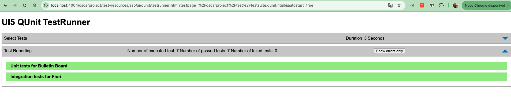
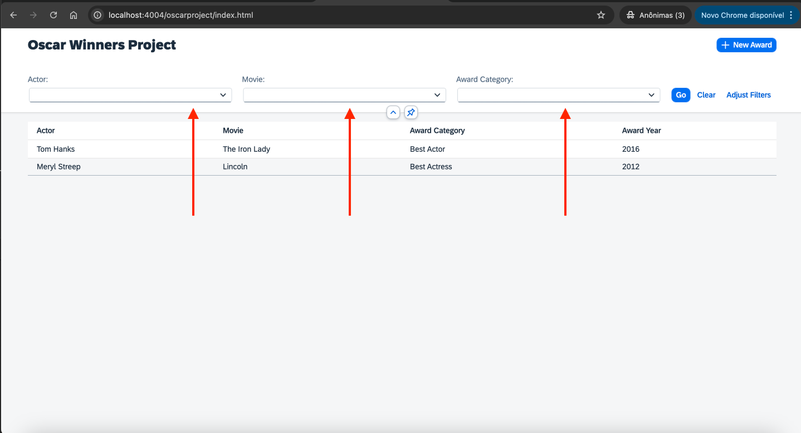

## Application Details
|               |
| ------------- |
|**Generation Date and Time** Mon Feb 03 2025 11:46:09 GMT-0300 (Horário Padrão de Brasília)|
|**App Generator** @sap/generator-fiori-freestyle|
|**App Generator Version** 1.16.3|
|**Generation Platform** Visual Studio Code|
|**Template Used** simple|
|**Service Type** Local Cap|
|**Service URL** http://localhost:4004/odata/v4/oscar/|
|**Module Name** oscarproject|
|**Application Title** Oscar Project|
|**Namespace** |
|**UI5 Theme** sap_horizon|
|**UI5 Version** 1.132.1|
|**Enable Code Assist Libraries** False|
|**Enable TypeScript** False|
|**Add Eslint configuration** False|

## oscarproject

An SAP Fiori application.

### Starting the generated app

-   This app has been generated using the SAP Fiori tools - App Generator, as part of the SAP Fiori tools suite.  In order to launch the generated app, simply start your CAP project and navigate to the following location in your browser:

http://localhost:4004/oscarproject/webapp/index.html

## Table of Contents

- [Pre-requisites](#prerequisites)
- [How to Run](#how-to-run)
- [Challenge Development](#challenge-development)
- [Opa5 Tests](#opa5ptests)
- [User Tests](#userTests)

## Prerequisites

- Install dependencies `npm install` inside the oscarproject folder [node and npm](https://docs.npmjs.com/downloading-and-installing-node-js-and-npm).

## How to Run

To run the application, you can simply run `npm run start` or `npm run start:ts`, both will work correctly on the root folder project.

## Challenge Development

First, I created the project using the Fiori Open Generator tools. After the application was created, I created the settings for reading Odata and also the Views for viewing, creating and editing the data.

I created a file to GET/SET the model globally in all the project files, called GlobalModel.js inside the /model folder. This allows me to set the model more easily.

After I opened the App.controller.js file, took the project's main model configured in Manifest.json and set it in GlobalModel.js.

The premise of the project was to list, create and edit the award data, for this I created a file called AwardModel.js, where within this file I standardized the update, create and get calls, thus the code is more organized and performant for better performance and support.

With the files to list the data, connect the model and other configurations done, I created the View and Controller files for listing the data and the form for creating and editing awards.

View
- ListWinners.view.xml
- ObjectForm.view.xml

Controller
- ListWinners.controller.js
- ObjectForm.controller.js

I also created Fragments files for better organization of the screens and code, in addition to using the Framework's best practices.

Fragments
- Filters.fragment.xml
- Form.fragment.xml

All View files were used with i18n with translations in English and Brazilian Portuguese.

In the manifest.json file, I created the routes for the list views and forms

## Opa5 Tests

I created 2 scenarios for unit tests that can be accessed via the Link

[Application](http://localhost:4004/)

Link 1 Runner

Link 2 Unit Tests

## User Tests

- Access the link
[Application](http://localhost:4004/oscarproject/index.html)

When accessing the application, it is possible to check the list of winners, where this list can be filtered:

And when you click on Go the filter is selected and the list is filtered

By selecting the item by clicking on it in the table, you will be sent to the item editing page, where you can edit the registration.

And after editing the items, you can click on the save button, and a success message will appear and after the message you are redirected to the list again with the edited items.

Also on the listing screen there is a button in the upper right corner, called "New Award", where by clicking on it you will be redirected to the same registration screen, but now to create a new record.

Once you have filled in the details, simply click on the "New Award" button and a new record will be created.

And the list will come back and be updated.

